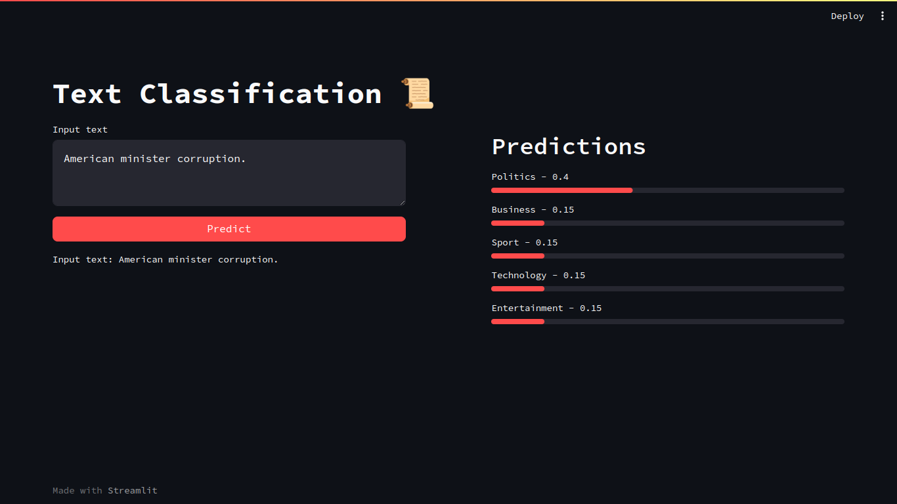
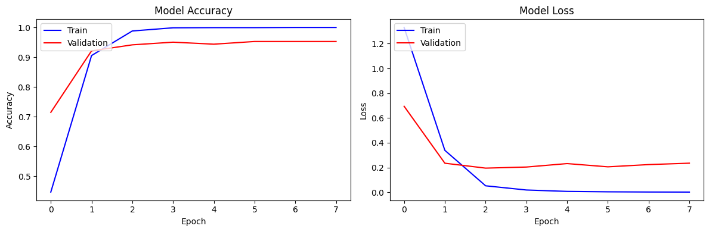

# Text Classification



Text classification of news articles using a pre-trained model (bidirectional LSTM) and Streamlit web app.

## Dataset

The dataset used for training the model is [Kaggle - Text Document Classification](https://www.kaggle.com/datasets/sunilthite/text-document-classification-dataset). The dataset  contains **2225 text data** and **five categories** of documents. Five categories are politics, sport, tech, entertainment and business. We can use this dataset for documents classification and document clustering.

* Dataset contains two features text and label.
* **No. of Rows : 2225**
* No. of Columns : 2

**Text**: It contains different categories of text data

**Label**: It contains labels for five different categories : 0,1,2,3,4

* Politics = 0
* Sport = 1
* Technology = 2
* Entertainment =3
* Business = 4

## Training Flow

1. Load the dataset
2. Preprocess the text data
   1. Clean the text data
   2. Tokenize the text data
   3. Pad the text data
3. Create the model
   1. Embedding layer
   2. Bidirectional LSTM layer
   3. Dense layer
4. Train the model
5. Evaluate the model
6. Save the model

## Training Results



According to the training results, the model is overfitting. The model is trained for 14 epochs. The training accuracy is 100% and validation accuracy is 95%. The result of inference also skewed into one category. The model is not able to predict the correct category for the given text data. The training notebook is available in [Google Colab Notebook](https://colab.research.google.com/drive/17-G7iVgiR96QCNgri5Y6Uw3vSjW07HzA?usp=sharing).

For next training, we can add dataset for more categories and more text data. We can also use SOTA (State of the Art) model for training, such as Transformer, BERT, etc.

## How to Use

Easy way to deploy this project is using docker. Make sure you have installed docker in your machine.

1. Clone this repository
``` bash
git clone https://github.com/hiseulgi/text-classification.git
```
2. Copy `.env.example` to `.env` and change the value
``` bash
cp .env.example .env
```
3. Build docker image for first time and run service
``` bash
# build and run compose for first time
bash scripts/build_docker.sh

# run compose after first time
bash scripts/run_docker.sh
```
4. Open and test the service at API docs `http://localhost:6969/`

5. Open and test the service at Web App `http://localhost:8501/`

## Future Work

- [ ] Add more dataset
- [ ] Train with Transformer model